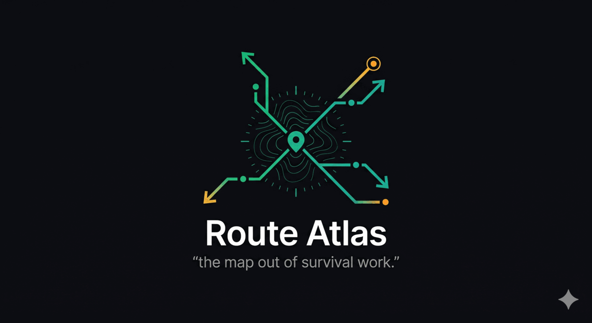

<p align="center">
  
</p>

<p align="center">
  <strong>The map out of survival work.</strong><br />
  <em>An AI route cartographer for Nigerian post-NYSC graduates stuck in jobs that don't lead anywhere.</em>
</p>

<p align="center">
  <a href="#quick-start">Quick start</a> ·
  <a href="#what-it-does">What it does</a> ·
  <a href="#why-it-works">Why it works</a> ·
  <a href="#tech-stack">Tech</a> ·
  <a href="#license">License</a>
</p>

---

## The problem

Nigerian graduates finish NYSC with degrees the job market doesn't want and drift into survival work — lesson teaching, POS, ride-hailing, sales — because **no one maps the real routes forward from their specific situation**. Parents give advice from a 1990s job market. LinkedIn shows jobs, not paths. Generic AI doesn't know NYSC timing, JAPA economics, or which bootcamps actually place people. The decision that shapes the next 10 years of someone's life gets made on vibes and proximity.

## What it does

Route Atlas takes a graduate's full situation — degree, NYSC status, state, savings, family obligations, JAPA appetite, marital status, children, existing skills, hard-nos — and produces a **ranked atlas of 4 routes forward**. Each route comes with:

- A fit score (0–100) that cites the user's intake fields by name
- Real ₦ pay bands (entry / mid / senior), honestly calibrated to Nigerian reality
- Time to first income in months
- A 2-year projection — a concrete scene with real numbers and specific milestones
- 3 Monday actions with specific companies, URLs, and people to DM
- 2 insider pro tips only someone inside that Nigerian route would know
- A 3-phase roadmap showing income growth
- Who the route fits, who it breaks, and why
- Nigerian-specific notes (pharma corridor geography, JAPA visa economics, NYSC bye-laws)

Plus a `routes_filtered_out` list showing what the model considered and rejected for *this specific user* — the transparency that builds trust.

## Why it works

The moat isn't the AI — it's the **Nigerian context layer**. The system prompt encodes:

- NYSC mechanics (PPA postings, Clause 22 spousal redeployment, passing-out timing)
- Degree → real-market routes for 25+ common Nigerian degrees
- Salary bands by sector × city in 2026 ₦
- JAPA economics for Canada SDS, UK Skilled Worker, Germany Ausbildung/Chancenkarte, Australia 189/190, UAE — real costs, real odds
- Survival-work taxonomy (POS, lesson teaching, Bolt, MLM) with exit routes per type
- Igba Boi / Igbo apprenticeship model with settlement figures
- Bootcamp reality (which place people, which don't)
- Family-stage context — married grads with working spouse, children under 5, JAPA family-reunion pathways
- Real companies, real WhatsApp groups, real salary floors

No generic AI can produce *"Apply Tuesday 8am on MyJobMag — HR screens before weekly production meetings"* or *"Sagamu-Ota-Agbara pharma corridor is 90 minutes from Ibadan"* without this context.

## Quick start

**Requires:** Node 20+, an [Anthropic API key](https://console.anthropic.com/).

```bash
# 1. Clone
git clone https://github.com/goddyjay/route-atlas.git
cd route-atlas

# 2. Backend
npm install
cp .env.example .env
# Add your ANTHROPIC_API_KEY to .env
npm run dev   # starts on :3001

# 3. Frontend (new terminal)
cd client
npm install
npm run dev   # starts on :5174
```

Open `http://localhost:5174`, click **Try Demo**, and watch Opus 4.7 stream a live atlas for a Microbiology grad in Ibadan.

## Features

- 🧭 **Live SSE streaming** — progress bar fills as Claude generates, no more staring at a 100-second skeleton
- 🎯 **Confidence rings** — animated circular progress rings per route with ease-out-cubic counters
- 📊 **Compare view** — side-by-side grid of all 4 routes on fit, demand, pay, time-to-income
- ⏳ **Animated journey timeline** — gradient connector line draws in, phase nodes pop, milestones stagger
- 🎨 **Emerald/teal premium theme** with color-coded form sections and tinted icon bubbles
- 🇳🇬 **Nigerian-specific intake** — 23 fields including NYSC status, state, savings in ₦, marital status, spouse employment, children, family pressure, JAPA appetite, hard-nos
- 💬 **3 one-click demo presets** + a prominent "Try Demo" CTA (Microbiology/Ibadan · Philosophy/Kano · Mass Comm/Lagos · Accounting/Abuja/married)
- 🔮 **2-year projection** — a concrete scene for each route, not a vague aspiration
- 💡 **Insider pro tips** — specific tactical moves only someone in that Nigerian industry would know
- 🧩 **Custom chip pickers** — 47 preset skills + type your own; same for hard-nos
- ⚡ **Prompt caching** — Nigerian context block cached so repeated calls are fast and cheap

## Tech stack

- **Backend:** Node.js + Express, `@anthropic-ai/sdk`, `express-validator`, helmet, CORS, SSE streaming
- **Frontend:** React 18, Vite, TailwindCSS, framer-motion, react-hook-form, zod, lucide-react
- **AI:** Claude **Opus 4.7** (`claude-opus-4-7`) with ephemeral prompt caching
- **Styling:** Dark theme, emerald primary (`#10b981`) + teal accent (`#14b8a6`), amber for insights, gold for top matches

## Architecture

```
route-atlas/
├── server.js                 # Express entry
├── src/
│   ├── app.js                # App wiring + health check
│   ├── services/claude.js    # Anthropic SDK wrapper + streaming + JSON extraction
│   ├── modules/
│   │   ├── routeAtlas.js     # System prompt (~7k tokens Nigerian context) + validators + response schema
│   │   └── index.js          # Module dispatcher (pluggable for future modules)
│   ├── controllers/
│   │   └── recommendationsController.js  # JSON + SSE handlers
│   └── routes/recommendations.js         # POST / + POST /stream + GET /types
└── client/
    ├── src/
    │   ├── App.jsx                       # Full-height app shell
    │   ├── routes/AtlasPage.jsx          # Split-pane layout + progress wiring
    │   ├── components/
    │   │   ├── Logo.jsx                  # SVG mark + full lockup
    │   │   ├── Navbar.jsx
    │   │   ├── AtlasForm.jsx             # 23-field intake with chip pickers
    │   │   ├── AtlasView.jsx             # Snapshot + header + cards + filtered-out
    │   │   ├── RouteCard.jsx             # Expandable route card with timeline
    │   │   └── CompareView.jsx           # Side-by-side compare table
    │   └── lib/
    │       ├── api.js                    # fetchRouteAtlas + streamRouteAtlas (SSE parser)
    │       ├── nigerian.js               # States, degrees, intake enums, skill presets
    │       └── presets.js                # 4 demo personas
    └── public/
        ├── route-atlas-logo.png          # 95 KB optimized lockup
        └── route-atlas-favicon.png       # 67 KB mark-only crop
```

## Hackathon context

Built for the **Claude Opus Hackathon** (April 2026) under the *Build From What You Know* track. Everything — backend, frontend, prompt, assets — was created from scratch during the hackathon window. Published under MIT license (see [LICENSE](LICENSE)).

## License

MIT © 2026 Godwin Adeoluwa — see [LICENSE](LICENSE) for the full text.
